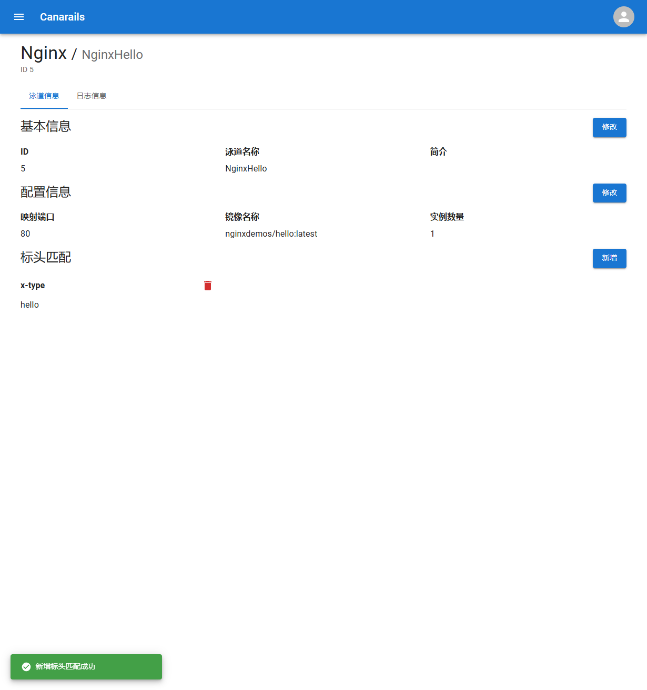
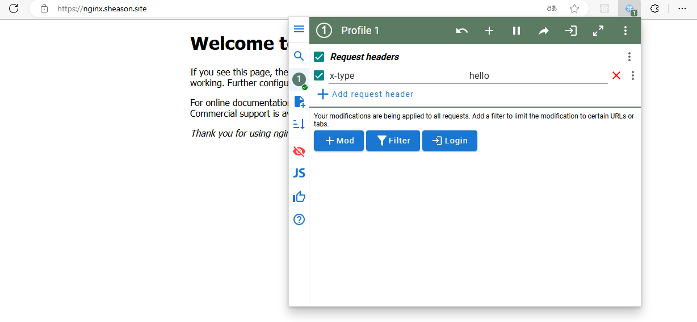
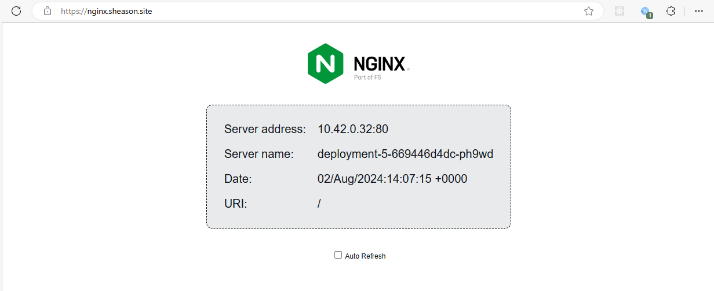

Canarails 通过 Header 匹配的方式实现金丝雀发布，当未找到匹配的金丝雀节点时，则降级到默认节点，如果默认节点也不存在，则返回 404NotFoundError。

在开始使用一节中，我们在 App 详情页面创建了一个默认泳道，其含义就是为应用创建了一个默认节点。

现在，我们创建一个新的节点 NginxHello，将其镜像名称设置为 `nginxdemos/hello:latest`，实例数量设置为 1，添加标头匹配 `x-type` 值为 `hello`，修改后的详情页面内容如下：

此时，我们尝试访问 `nginx.sheason.site`，可以看到网页展示的内容仍然是之前的 nginx welcome 页面，这是因为流量被 Kubernetes Gateway 分发到了默认节点。

现在，我们使用 Chrome 的扩展 ModHeader 修改浏览器的请求头，将我们上面添加的标头匹配内容填写到 mod header 请求头配置中：

刷新页面再次访问：

可以看到网页的展示内容已变更为 `nginxdemos/hello:latest` 提供的页面，这表示我们已经通过请求头匹配的方式进入了金丝雀环境。
