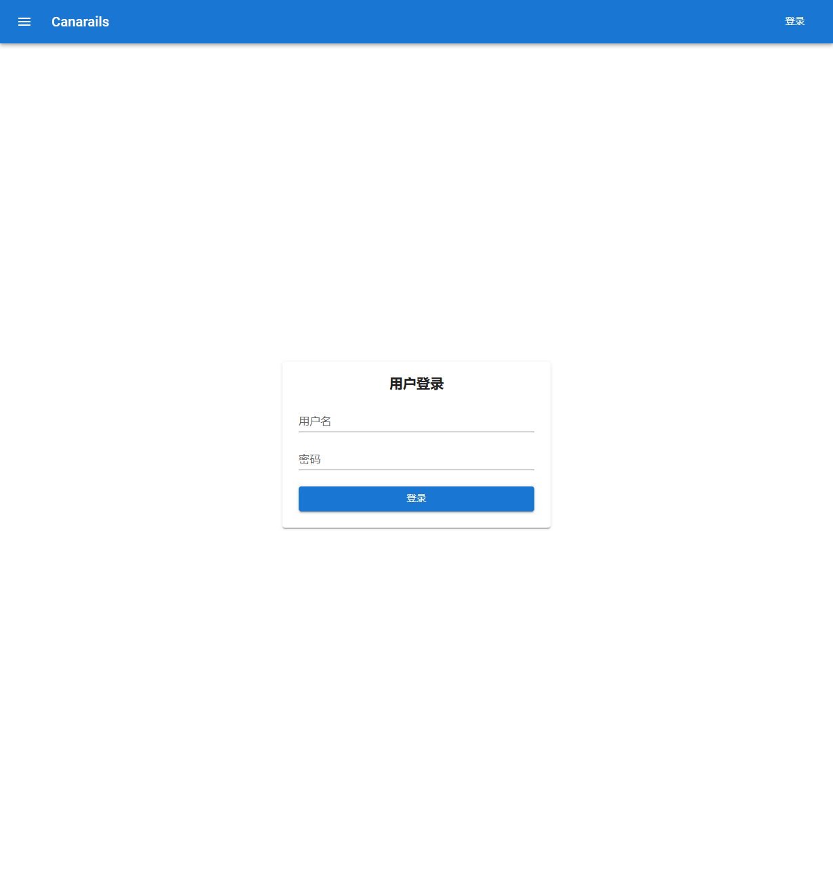
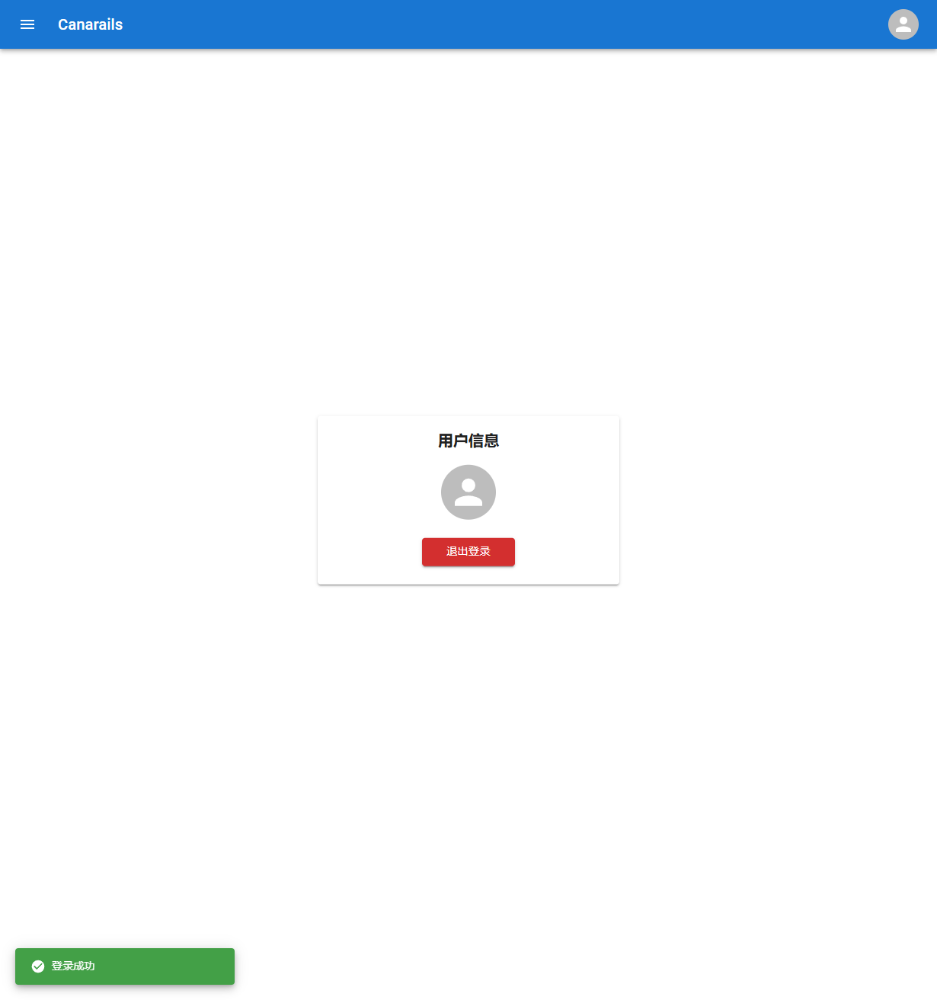
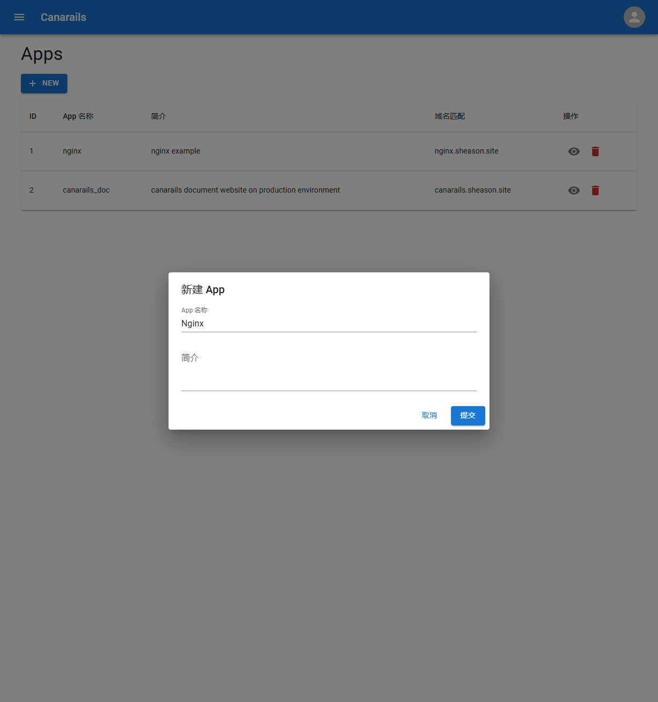
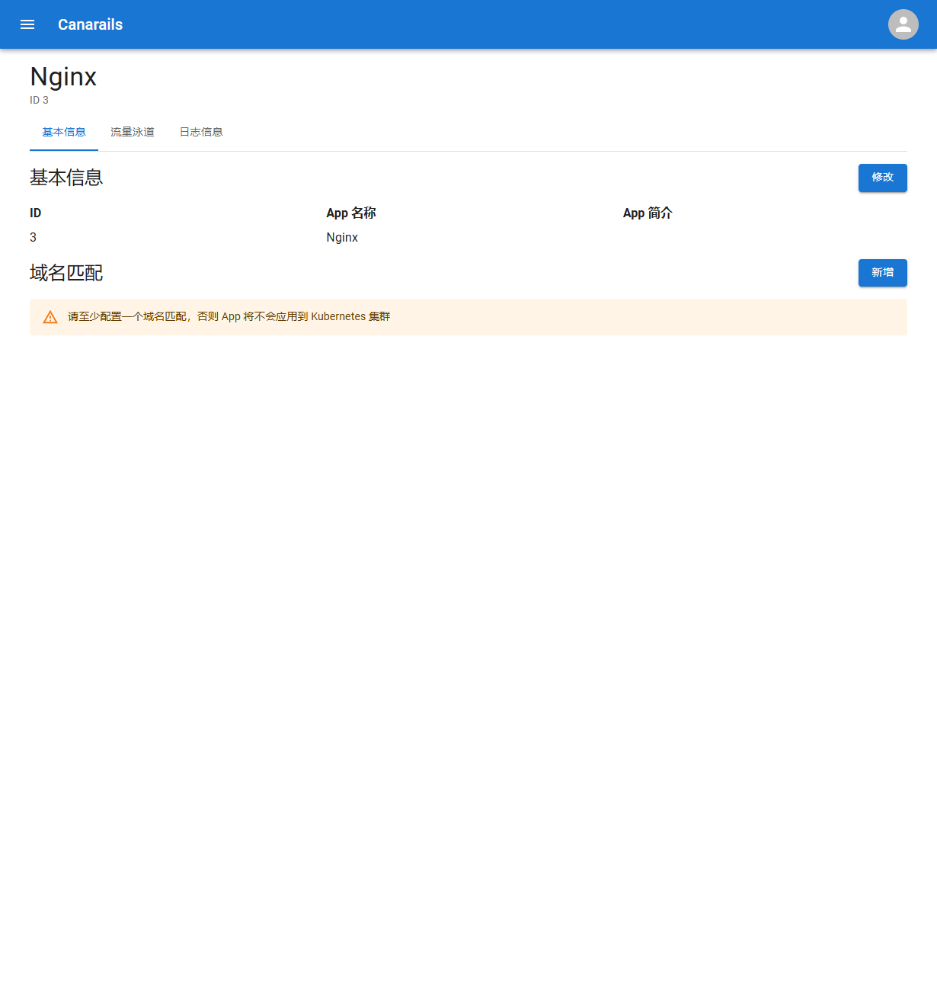
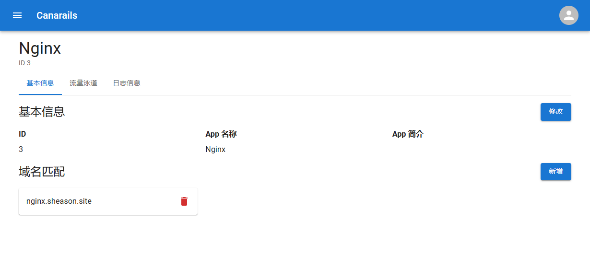
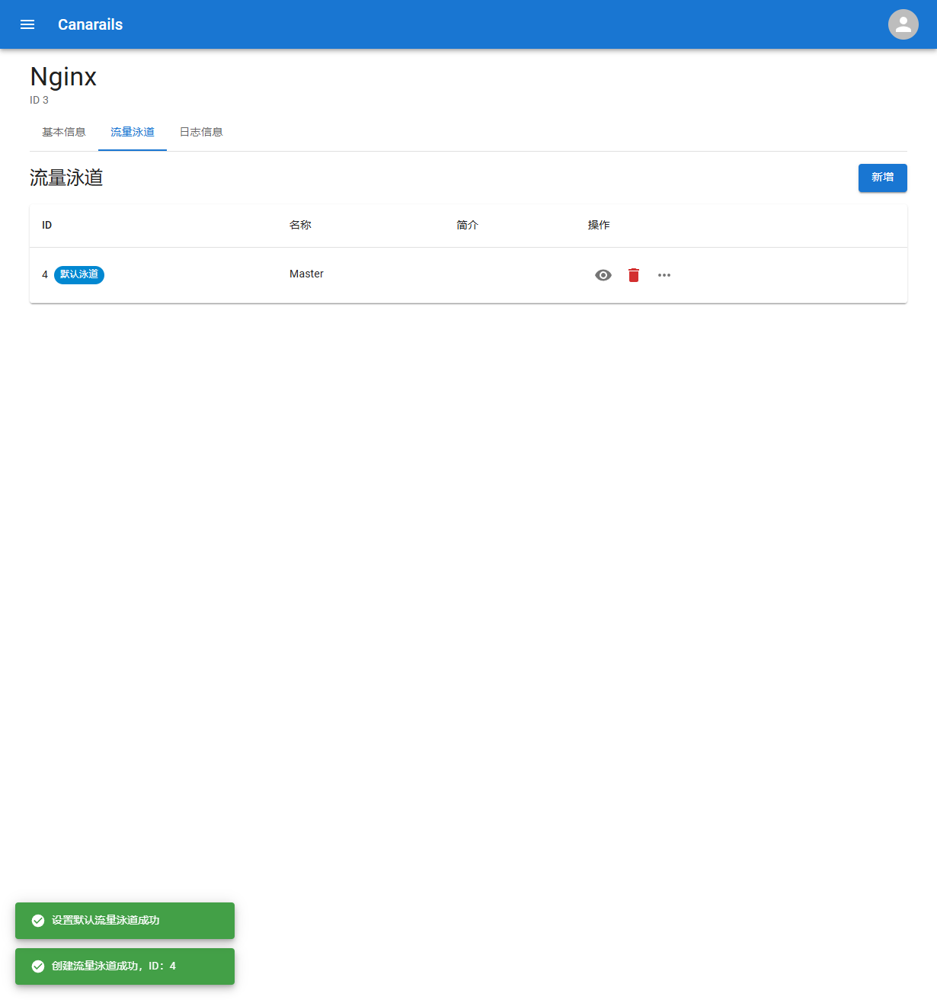
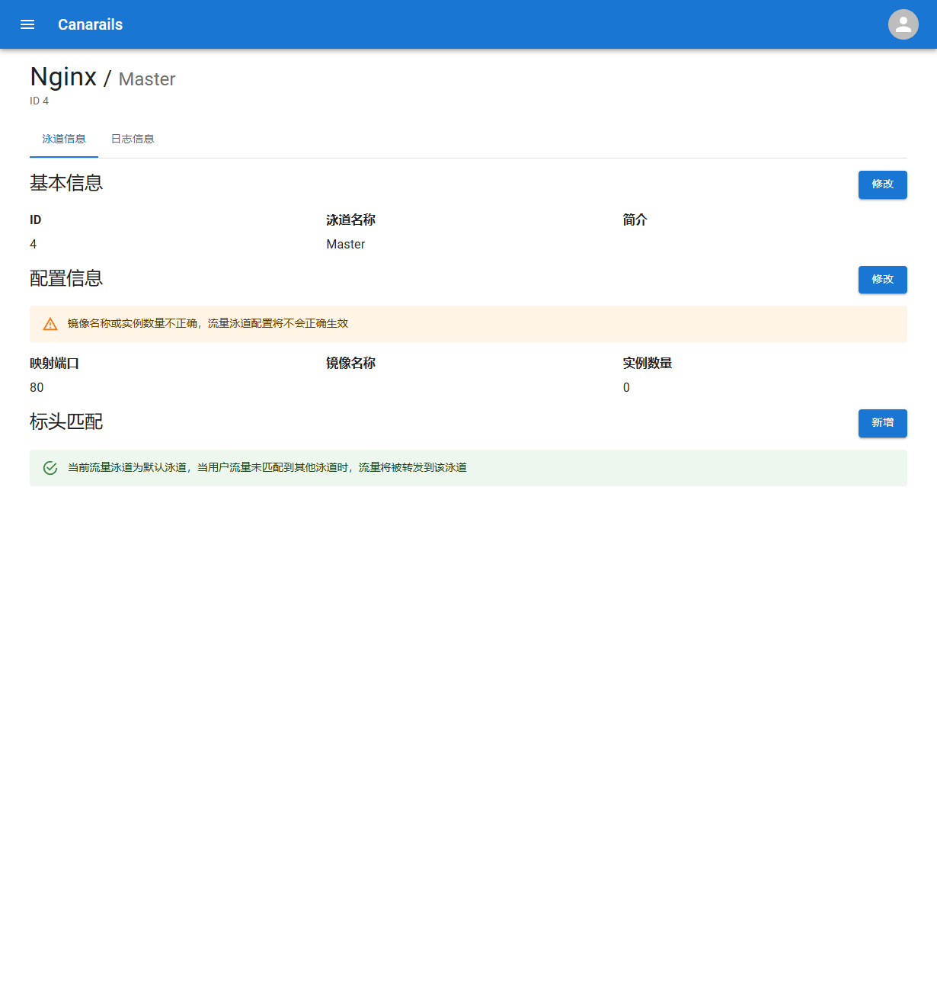
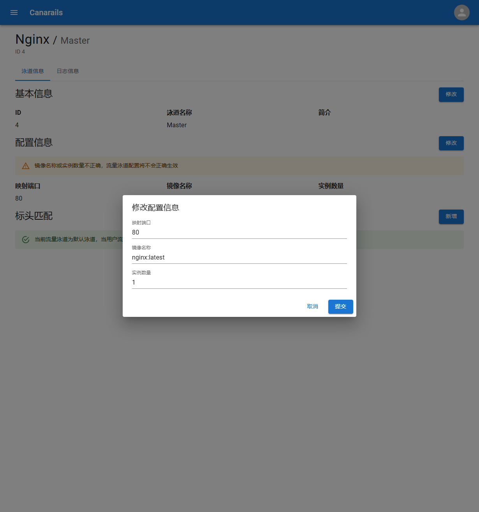

上一章节我们完成了 Canarails 的安装，在这一章节，我们会使用 Canarails 部署一个简单的 Nginx 应用。

首先在浏览器打开 Canarails 控制台，点击右上角的登录按钮，进入登陆页面：

输入用户名 admin，以及在安装时定义的管理员密码，完成登录：

回到首页，点击 Apps 下的 `NEW` 按钮，打开新建 App 表单，在 `App名称` 一栏中输入 `Nginx` 或是其他任何你喜欢的字符串，然后提交：

成功创建新的 App 以后，下方的列表会添加一行新的记录，点击操作一栏中的眼睛按钮，进入详情页面：

这里 Canarails 会发出警告，因为 Canarails 需要通过 Hostname 分发进入网关的流量，而这里 App 还没有配置可用的 Hostname，所以 Canarails 就会认为这个服务暂时还处于不可用的状态。

现在我们为这个新创建的 App 新增一个域名匹配，这里我使用 `nginx.sheason.site` 作为域名，这里的域名可以根据自己的需要随意修改，但必须要保证填入的域名能正常解析到 Kubernetes Gateway。

在添加域名解析后，点击上方的流量泳道 Tab 进入流量泳道列表页，在泳道名称中填入 Master 然后提交，列表中会出现一条记录：

然后我们点击操作栏中的菜单按钮，点击 `设置为默认流量泳道` 选项，此时流量泳道右侧会出现一个 `默认泳道` 标识：

然后我们点击操作栏中的查看详情按钮，进入流量泳道详情页面：

通过上面的图片，我们可以看到配置信息中存在着警告信息，这是因为我们还没有为该流量泳道配置镜像信息和实例数量，点击配置信息右侧的修改按钮，填入以下信息：

提交后，Canarails 会开始变更 Kubernetes 配置，稍后访问我们在上面设置的域名 `nginx.sheason.site`，即可看到由 Canarails 部署的 `nginx:latest` 镜像：

